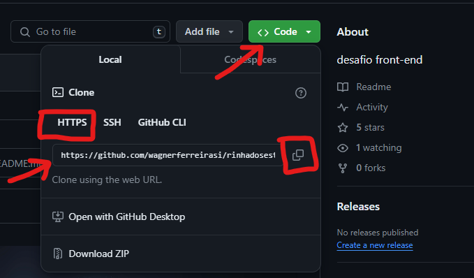

# COMO ACESSO O LAYOUT E ENVIO MEU PROJETO

## 1. Bifurcar um repositório

1.  Navegue até o projeto `rinhadosestagiarios` no [GitHub](https://github.com/wagnerferreirasi/rinhadosestagiarios)

2.  No canto superior direito da página, clique em Criar Fork ou Create new fork.

3.  Em "Proprietário", selecione o menu suspenso e clique em um proprietário do repositório com fork.

4.  Por padrão, os forks são nomeados da mesma forma que os respectivos repositórios pai. Opcionalmente, para distinguir ainda mais o fork, no campo "Nome do repositório", digite um nome.

5.  Opcionalmente, no campo "Descrição", digite uma descrição do fork.

6.  Opcionalmente, selecione Copiar somente o branch PADRÃO.

> Para muitos cenários de bifurcação, como contribuir para projetos de código aberto, você só precisa copiar o branch padrão. Se você não selecionar essa opção, todos os branches serão copiados para o novo fork.

7.  Clique em Criar bifurcação.

 
 

## 2. Clonando uma bifurcação

Você criou com sucesso o repositório `rinhadosestagiarios` mas, até agora, ele só esta no GitHub. Para poder trabalhar no projeto, você deverá cloná-lo para o seu computador.

> Você pode clonar a sua bifurcação com a linha de comando, GitHub CLI ou GitHub Desktop.

1.  No GitHub, navegue até o **seu fork** do repositório `rinhadosestagiarios`

2.  Acima da lista de arquivos, clique em <> Código.

3.  Copie a URL do repositório.

4.  Abra Terminal do seu computador.

5.  Altere o diretório de trabalho atual para o local em que deseja ter o diretório clonado.

6.  Digite `git clone` e cole a URL já copiada. Ela terá esta aparência, com seu nome de usuário do GitHub:

    > https://github.com/wagnerferreirasi/rinhadosestagiarios.git

7.  Pressione Enter. Seu clone local será criado.

        $ git clone https://github.com/wagnerferreirasi/rinhadosestagiarios 
        Cloning into `rinhadosestagiarios`... 
        remote: Counting objects: 10, done. 
        remote: Compressing objects: 100% (8/8), done. 
        remove: Total 10 (delta 1), reused 10 (delta 1) 
        Unpacking objects: 100% (10/10), done. 

 
 

## 3. Como criar uma branch

> Antes de fazer alterações no projeto, você deve criar um branch e fazer check-out. Mantendo as alterações no próprio branch, você segue o GitHub Flow e garante que será mais fácil contribuir com o mesmo projeto novamente no futuro

    git branch BRANCH-NAME 
    git checkout BRANCH-NAME

 
 

## 4. Fazendo e enviando por push as alterações

> Dentro do diretorio Participantes crie um diretorio com seu nome de usuário do GitHub, onde vai desenvolver seu projeto

Quando estiver pronto para enviar suas alterações, teste e faça commit das suas alterações. `git add .` informa o Git de que você deseja incluir todas as alterações no próximo commit. `git commit` cria um instantâneo dessas alterações.

    git add .
    git commit -m "descricao do seu commit"

No momento, suas alterações existem apenas localmente. Quando estiver pronto para fazer push das suas alterações para GitHub, faça push delas para o controle remoto.

    git push

## 5. Fazendo um pull request

> Finalmente, você está pronto para enviar o seu projeto para avaliação no projeto principal! Essa é a última etapa para entregar seu projeto, e a mais importante, indiscutivelmente.

1.  Para fazer isso, acesse o repositório no seu GitHub. Neste exemplo, ele estará em `https://github.com/<your_username>/rinhadosestagiarios`. Você verá uma notificação indicando que o branch está um commit à frente de rinhadosestagiarios:main. Clique em Contribuir e em Abrir uma solicitação de pull.

> O GitHub levará você para uma página que mostra as diferenças entre o fork e o repositório wagnerferreirasi/rinhadosestagiarios. Clique em Criar solicitação de pull

2.  GitHub levará você a uma página onde você pode inserir um título e uma descrição das suas alterações. Por fim, clique em Criar solicitação de pull.
